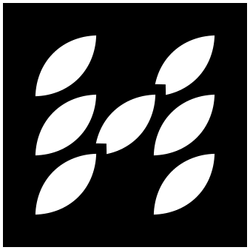
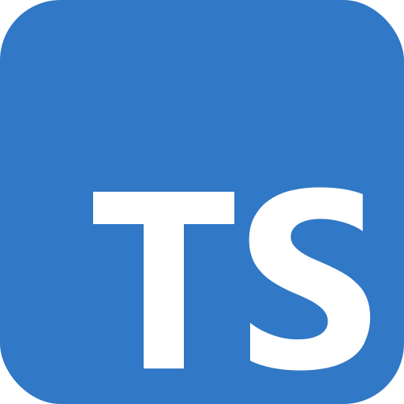

## Hi 👋 I'm Alex!

### ✨ About me

I am a fullstack engineer at [@octoenergy](https://github.com/octoenergy) based in the UK. I am passionate about tooling and technologies which make engineering more sustainable, safe, and fun. In my spare time, I am on a mission to build a programming language and tooling ecosystem for **Hash** - a language I am building.

### 🔭 I’m currently working on

<!-- - [x] [**feds01.github.io**](https://feds01.github.io) - My personal website -->

-  **Hash** programming language

  - [`compiler`](https://github.com/hash-org/hashsc) - The core Hash compiler `hashc` written in .
  - [`spec`](https://github.com/hash-org/spec) - The Hash language specification, written in Sphinx and . Read all about it [here](https://hash-org.github.io/spec/)!
  - [`metrics`](https://github.com/hash-org/metrics) - The Hash compiler metrics collection system, written in .

-  **Graphika** A toy graphing library written in pure . Functioning as a alternative to `Chart.js` and charting/graphing libraries.

-  **Durachok** - A online web-based game for playing Durak, a popular Russian card game, with
   + , with some cool libraries, including `@tanstack/router`, `@tanstack/react-query`, `socket.io`.

-  **Bracketlint** - A simple HTML/Django linter for checking the correctness of brackets in HTML files, written in .

### 🌱 I’m currently learning

- **tRPC** - tRPC for end-to-end typesafety in API. Use with `zod` for schema validation.

- **@tanstack/router** - A tiny, fast, and functional router for React with an emphasis on type-safety.

### 📫 Contact me

- [LinkedIn](https://www.linkedin.com/in/alexander-e-fedotov/)

<!-- <a href="https://www.linkedin.com/in/alexander-e-fedotov/" target="_blank"></a> -->

<details>
  <summary><b>🛠️&nbsp;&nbsp;Languages&nbsp;and&nbsp;Tools</b></summary>
  <br/>
  <a href="https://skillicons.dev">
  
  </a>
</details>

<details>
  <summary><b>🔒&nbsp;&nbsp;PGP&nbsp;Public&nbsp;Key</b></summary>
  <br/>

```
-----BEGIN PGP PUBLIC KEY BLOCK-----

mDMEZp1C6BYJKwYBBAHaRw8BAQdAbmZl2T8wr8K+FtvXsGgD3+bOBxJf99twYgie
9js1JKa0MkFsZXhhbmRlciBGZWRvdG92IDxhbGV4YW5kZXIuZmVkb3Rvdi51a0Bn
bWFpbC5jb20+iJMEExYKADsWIQSsi4t4Az9AkaW7dFKtGxvm5K2JQAUCZp1C6AIb
AwULCQgHAgIiAgYVCgkICwIEFgIDAQIeBwIXgAAKCRCtGxvm5K2JQDZVAP94bpZC
ffX2e64qqvOyP50GqMWPE0iK5s6Ka8D9P9KqhgEAlJIVCSSX9yEhplx0zfy4sqcX
meu1H6WSE5MWpQXZ2gi4OARmnULoEgorBgEEAZdVAQUBAQdAjA60vQ4kEdaz5s/c
8UQ2qnXQjLdpwahRQKCT7t2McBoDAQgHiHgEGBYKACAWIQSsi4t4Az9AkaW7dFKt
Gxvm5K2JQAUCZp1C6AIbDAAKCRCtGxvm5K2JQDymAPwOS5+7n4I3sL2XK9mj4JT5
HkhIjEj145OpvhXIDk+YwgD8CV4LjAlioR6U930Alf9XZw1nKDLLhUoPB3vD9VT5
RQc=
=rbOz
-----END PGP PUBLIC KEY BLOCK-----
```

</details>

______________________________________________________________________

<p float="left">
<a href="https://github.com/anuraghazra/github-readme-stats">
  
</a>
<a href="https://github.com/anuraghazra/github-readme-stats">
  
</a>
</p>
