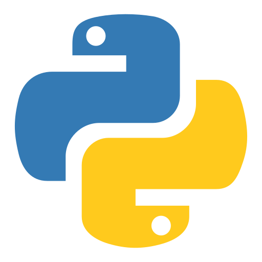

## Hi 👋 I'm Alex!

### ✨ About me

I am a senior product engineer at [@userledio](https://github.com/userledio) based in the UK. I'm passionate about infrastructure, developer experience, system design, and agentic technologies — building tools and systems that make engineering more sustainable, safe, and fun. In my spare time, I'm building **Hash** — a programming language and tooling ecosystem.

### 🔭 I'm currently working on

<!-- - [x] [**feds01.github.io**](https://feds01.github.io) - My personal website -->

-  **Hash** programming language

  - [`compiler`](https://github.com/hash-org/hashc) - The core Hash compiler `hashc` written in .
  - [`spec`](https://github.com/hash-org/spec) - The Hash language specification, written in Sphinx and . Read all about it [here](https://hash-org.github.io/spec/)!
  - [`metrics`](https://github.com/hash-org/metrics) - The Hash compiler metrics collection system, written in .

-  **Graphika** A toy graphing library written in pure . Functioning as a alternative to `Chart.js` and charting/graphing libraries.

-  **Durachok** - A online web-based game for playing Durak, a popular Russian card game. Built with
   + , including some cool libraries: `@tanstack/router`, `@tanstack/react-query`, `socket.io`.

-  **Bracketlint** - A simple HTML/Django linter for checking the correctness of brackets in HTML files, written in .

-  **teamsearch** - A tool to look for and in files via `CODEOWNERS`, written in .

### 🧰 Developer experience tooling

At work, I've built internal tools to improve developer workflows:

- **bracketlint** and **teamsearch** originated from DX work at Kraken Technologies
- Infrastructure, CI/CD pipelines, and analytics systems at Userled
- Cataloguing, contracts, and order management systems at Kraken Technologies

### 🌱 I'm currently exploring

- **Agentic technologies** - LLM-powered agents, tool use, and autonomous workflows (Vercel AI SDK, Mastra)
- **Vector databases** - Embeddings, similarity search, and RAG pipelines
- **Infrastructure as code** - Terraform, CI/CD design, and cloud-native patterns

### 📫 Contact me

- [LinkedIn](https://www.linkedin.com/in/alexander-e-fedotov/)
- [Email](mailto:alexander.fedotov.uk@gmail.com)

<!-- <a href="https://www.linkedin.com/in/alexander-e-fedotov/" target="_blank"></a> -->

<details>
  <summary><b>🛠️&nbsp;&nbsp;Languages&nbsp;and&nbsp;Tools</b></summary>
  <br/>
  <a href="https://skillicons.dev">
  
  </a>
</details>

<details>
  <summary><b>🔒&nbsp;&nbsp;PGP&nbsp;Public&nbsp;Key</b></summary>
  <br/>

```
-----BEGIN PGP PUBLIC KEY BLOCK-----

mDMEZp1C6BYJKwYBBAHaRw8BAQdAbmZl2T8wr8K+FtvXsGgD3+bOBxJf99twYgie
9js1JKa0MkFsZXhhbmRlciBGZWRvdG92IDxhbGV4YW5kZXIuZmVkb3Rvdi51a0Bn
bWFpbC5jb20+iJMEExYKADsWIQSsi4t4Az9AkaW7dFKtGxvm5K2JQAUCZp1C6AIb
AwULCQgHAgIiAgYVCgkICwIEFgIDAQIeBwIXgAAKCRCtGxvm5K2JQDZVAP94bpZC
ffX2e64qqvOyP50GqMWPE0iK5s6Ka8D9P9KqhgEAlJIVCSSX9yEhplx0zfy4sqcX
meu1H6WSE5MWpQXZ2gi4OARmnULoEgorBgEEAZdVAQUBAQdAjA60vQ4kEdaz5s/c
8UQ2qnXQjLdpwahRQKCT7t2McBoDAQgHiHgEGBYKACAWIQSsi4t4Az9AkaW7dFKt
Gxvm5K2JQAUCZp1C6AIbDAAKCRCtGxvm5K2JQDymAPwOS5+7n4I3sL2XK9mj4JT5
HkhIjEj145OpvhXIDk+YwgD8CV4LjAlioR6U930Alf9XZw1nKDLLhUoPB3vD9VT5
RQc=
=rbOz
-----END PGP PUBLIC KEY BLOCK-----
```

</details>

______________________________________________________________________

<p float="left">
<a href="https://github.com/anuraghazra/github-readme-stats">
  
</a>
<a href="https://github.com/anuraghazra/github-readme-stats">
  
</a>
</p>
